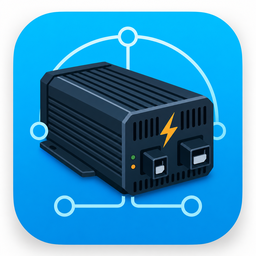
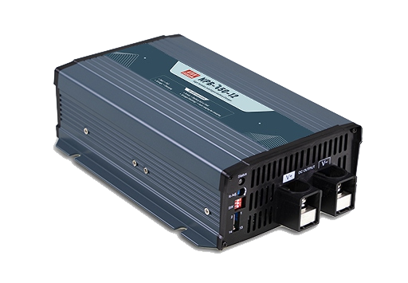
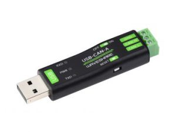

# Mean Well NPB-750 for Home Assistant

Home Assistant custom integration for the **MEAN WELL NPB-750-24** intelligent battery charger connected through a **Waveshare USB-CAN-A** serial-to-CAN adapter.



[](https://my.home-assistant.io/redirect/hacs_repository/?owner=pihrt-com&repository=mean-well-npb-750-to-hass&category=integration)

Direct HACS repository link:

```text
https://my.home-assistant.io/redirect/hacs_repository/?owner=pihrt-com&repository=mean-well-npb-750-to-hass&category=integration
```

## Supported Hardware

### MEAN WELL NPB-750-24



This integration was created for:

- Charger: `MEAN WELL NPB-750-24`
- CAN protocol: CANBus 2.0B extended frame
- CAN bitrate: `250000` bit/s
- Default charger CAN address used by this integration: `3`

Useful links:

- MEAN WELL website: https://www.meanwell.com
- Manuals used while building this integration:
  - `NPB,NPP-E.pdf`
  - `CANBus_MW_PS.pdf`
  - `nabijec 230v-24v NPB-750-spec.pdf`

### Waveshare USB-CAN-A



This integration expects the **Waveshare USB to CAN Adapter A**, also sold as **USB-CAN-A**.

Important details:

- The adapter is a USB-to-serial-to-CAN bridge.
- It does **not** expose a SocketCAN interface.
- You should not expect a Linux `can0` interface.
- Communication is done through the Waveshare serial protocol.
- The default serial bitrate is `2000000` bit/s.

The adapter was detected in Home Assistant OS using this stable path:

```text
/dev/serial/by-id/usb-1a86_USB_Serial-if00-port0
```

Where to get it:

- RPishop.cz product page: https://rpishop.cz/datove-redukce/5763-waveshare-usb-to-can-adapter-a.html
- Waveshare USB-CAN-A wiki: https://www.waveshare.com/wiki/USB-CAN-A

## Installation With HACS

The recommended installation method is HACS as a custom repository.

### 1. Install HACS

If HACS is already installed, skip this section.

For Home Assistant OS / Supervised:

1. Open **Settings**.
2. Open **Add-ons**.
3. Open **Add-on Store**.
4. Open the three-dot menu in the top right corner.
5. Open **Repositories**.
6. Add this add-on repository:

```text
https://github.com/hacs/addons
```

7. Install the **Get HACS** add-on.
8. Start the add-on.
9. Open its log and follow the instructions shown there.
10. Restart Home Assistant.
11. Add the **HACS** integration from **Settings** -> **Devices & services** -> **Add integration**.

Official HACS installation guide:

https://www.hacs.xyz/docs/use/download/download/

### 2. Add This Repository to HACS

Open this link:

```text
https://my.home-assistant.io/redirect/hacs_repository/?owner=pihrt-com&repository=mean-well-npb-750-to-hass&category=integration
```

Or use the HACS button at the top of this README.

Manual HACS path:

1. Open **HACS**.
2. Open the three-dot menu in the top right corner.
3. Open **Custom repositories**.
4. Add this repository URL:

```text
https://github.com/pihrt-com/mean-well-npb-750-to-hass
```

5. Select category: **Integration**.
6. Click **Add**.
7. Open the repository in HACS.
8. Click **Download**.
9. Restart Home Assistant.

HACS installs the integration into:

```text
/config/custom_components/mean_well_npb_750
```

## Adding the Charger in Home Assistant

After restarting Home Assistant:

1. Open **Settings**.
2. Open **Devices & services**.
3. Click **Add integration**.
4. Search for **Mean Well NPB-750**.
5. Use these settings:

```text
Serial device: /dev/serial/by-id/usb-1a86_USB_Serial-if00-port0
CAN address: 3
CAN bitrate: 250000
Serial baudrate: 2000000
```

## Entities

The integration creates:

- operating mode select: `Charger` / `Power supply`
- output voltage sensor
- output current sensor
- internal temperature sensor
- fault status sensor
- system status sensor
- output on/off switch
- output voltage setpoint number entity
- output current setpoint number entity

In charger mode it also creates charger-specific diagnostics and actions:

- charge status sensor
- automatic recharge voltage sensor
- charging attention sensor
- restart charging button
- force charging start button
- enable automatic recharge button

These charger-specific entities are not created while the unit is in power-supply mode, because they do not apply to normal PSU operation.

Note: according to the MEAN WELL manual, `VOUT_SET` and `IOUT_SET` are mainly useful in power-supply mode. In charger mode, the charger may ignore some setpoint commands depending on its current configuration.

The NPB-750 command table marks `READ_VIN` (`0x0050`) as unsupported/problematic for this model family, so input voltage is not polled by default.

## Operating Modes

The NPB-750 can operate either as a battery charger or as a DC power supply.

The integration exposes this as an operating mode select:

```text
Charger
Power supply
```

Internally this writes `CURVE_CONFIG` (`0x00B4`) bit 7 in the low byte:

```text
1 = charger mode
0 = power-supply mode
```

The integration preserves the other `CURVE_CONFIG` bits when changing this mode.

Important: the MEAN WELL manual states that `0x00B4` mode-related changes only take effect after AC power is applied again. After changing between charger mode and power-supply mode in Home Assistant, power-cycle the AC input of the NPB-750 if the physical behavior does not change immediately.

### Charger Mode

Charger mode is the default MEAN WELL mode. The unit follows the configured charging curve and exposes charger-specific status such as charge stage, automatic recharge voltage, and charging restart controls.

### Power-Supply Mode

Power-supply mode provides constant-voltage output. In this mode the normal controls are:

- output on/off switch
- output voltage setpoint
- output current setpoint
- output voltage/current monitoring
- temperature and status monitoring

The MEAN WELL manual states that `VOUT_SET` (`0x0020`) and `IOUT_SET` (`0x0030`) take effect immediately in power-supply mode after successful CAN transmission.

## Protocol Notes

MEAN WELL CAN identifiers:

```text
Controller -> charger: 0x000C01XX
Charger -> controller: 0x000C00XX
Broadcast -> charger: 0x000C01FF
```

`XX` is the charger CAN address. With address `3`, commands are sent to `0x000C0103` and responses are expected from `0x000C0003`.

Waveshare variable-length serial frame:

```text
AA TYPE ID... DATA... 55
```

For extended CAN data frames, `TYPE = 0xC0 | 0x20 | DLC`, and the CAN ID is encoded little-endian.

## Sources

- MEAN WELL `NPB,NPP-E.pdf`: NPB/NPP CANBus protocol
- MEAN WELL `CANBus_MW_PS.pdf`: CANBus command list
- MEAN WELL `nabijec 230v-24v NPB-750-spec.pdf`: NPB-750 datasheet
- Waveshare USB-CAN-A wiki: https://www.waveshare.com/wiki/USB-CAN-A
- Waveshare serial protocol: https://www.waveshare.com/wiki/Secondary_Development_Serial_Conversion_Definition_of_CAN_Protocol
- RPishop USB-CAN-A product page: https://rpishop.cz/datove-redukce/5763-waveshare-usb-to-can-adapter-a.html
